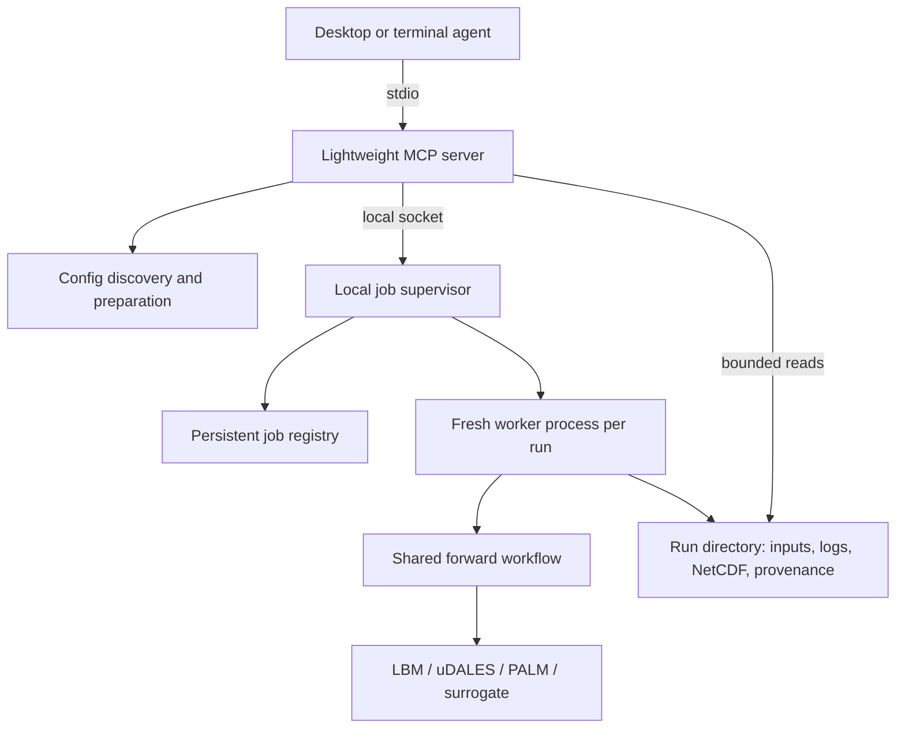

# Local MCP server for forward simulations

**Overview.** Add a local Python MCP server in `libs/mcp_server` that lets agents
discover settings, prepare a fully resolved run, launch it in the repository's
Pixi environment, and inspect or cancel it by run ID. Keep shared configuration,
workflow and job services in `pyurbanair`, with the MCP library providing the
agent-facing interface. Reuse the existing Hydra configuration and
forward workflow for uDALES, PALM, LBM and neural surrogates. Run simulations in
separate processes with private working directories and persistent results.
Use stdio for desktop and terminal clients; keep web connectivity optional.
Expose the full forward configuration, including backend input settings, rather
than maintaining a second, reduced configuration interface. First fix the
forward runner's incomplete result persistence and surrogate initialization.

Status: proposed implementation plan, researched on 2026-09-29. No server is
implemented by this document. Three research agents examined backend execution,
configuration, and MCP/client integration; their findings were checked against
the repository and official documentation.

**1. Scope and local client support**

The first release covers single simulations, ensembles, static or dynamic
parameters, and multi-window forward rollouts across all four backends. It
assumes a local clone with the selected backend installed and runnable. Include
configuration discovery, validation, launch, monitoring, cancellation and result
inspection. Assimilation, surrogate training, cluster submission and distributed
execution remain later workflows.

Give `libs/mcp_server` its own `pyproject.toml`, distribution name
`pyurbanair-mcp` and Python package `pyurbanair_mcp`. Declare the official Python
MCP SDK as a dependency of this library; installing the library remains optional
for simulation users. Add it through a dedicated Pixi `mcp` feature, with a
tested SDK version in the Pixi lockfile. Its current stable documentation
describes v2; select that
supported API when implementing rather than copying old FastMCP examples.
[Official Python SDK](https://py.sdk.modelcontextprotocol.io/).

| Client | Initial connection |
| --- | --- |
| Claude Code | Local stdio launcher registered with `claude mcp add`. |
| Claude Desktop | Local stdio launcher in its MCP server configuration. |
| ChatGPT desktop / Codex CLI / IDE | Local stdio launcher on the same Codex host. |
| ChatGPT web | Optional separate hosted connection; outside local-only acceptance. |

Claude supports local server configuration in its
[terminal client](https://code.claude.com/docs/en/mcp) and
[desktop app](https://support.claude.com/en/articles/10949351-getting-started-with-local-mcp-servers-on-claude-desktop).
Current OpenAI documentation says ChatGPT desktop, Codex CLI and the IDE
extension share MCP configuration on a Codex host and support stdio. Verify the
installed client version during setup; do not assume every ChatGPT surface reads
local configuration. [OpenAI local MCP configuration](https://learn.chatgpt.com/docs/extend/mcp?surface=cli).

ChatGPT web uses a different connection path. Its documented options include
public HTTPS or Secure MCP Tunnel to a private stdio/HTTP server, subject to
account and workspace access. This need not be part of the first release or
require publicly exposing this machine.
[ChatGPT connection setup](https://developers.openai.com/plugins/deploy/connect-chatgpt).

Target the repository's existing Linux x86-64 and macOS ARM64 environments.
Treat backend availability as a per-machine check; neither client installation
nor successful config composition proves that all four solvers run there.
Native Windows support is not an initial requirement. GPU execution uses the
existing Linux `cuda` environment when installed; CPU work uses `dev`.

**2. Architecture and reuse**

The package boundary follows the existing editable libraries under `libs/`.
`pyurbanair_mcp` depends on `pyurbanair`; the core package and solver libraries
must never depend on the MCP library or SDK. Keep tool registration, protocol
schemas and transport handling in `libs/mcp_server`. Configuration composition,
scientific validation, workflow execution, job supervision and artifact handling
remain reusable core services that scripts and tests can call directly.

This is a packaging boundary, not a standalone simulation installation. The
server still needs the local checkout, its `conf/` tree and the selected backend's
configured environment. It must receive an explicit repository root rather than
infer it from the installed library's directory. The MCP adapter calls core
services; workers select and load the backend at execution time.



Keep three concerns separate: MCP request handling, configuration preparation,
and job execution. A small local supervisor owns the queue and workers so an
app closing its stdio connection does not kill a simulation. All MCP instances
for the same checkout use that supervisor and registry. This also prevents two
clients from each believing they have the machine's only active job.

Autostart the supervisor under a startup lock, communicate over a user-private
Unix socket, and store jobs in SQLite on a local filesystem. The supervisor can
exit when idle. The launcher reconnects to an existing instance when present.
No HTTP service or network listener is necessary for this architecture. Keep
the transport adapter thin enough to add loopback Streamable HTTP later.

Reuse these existing seams:

| Existing code | Proposed use |
| --- | --- |
| [`scripts/preview_config.py`](../../scripts/preview_config.py) | Extract backend-free Hydra composition and choice reporting into a reusable helper. |
| [`src/pyurbanair/config/run_record.py`](../../src/pyurbanair/config/run_record.py) | Extend forward validation and explicit provenance. |
| [`scripts/run_forward_model.py`](../../scripts/run_forward_model.py) | Extract a shared workflow; preserve `run(cfg)` and the thin Hydra CLI wrapper. |
| [`conf/run_forward_model.yaml`](../../conf/run_forward_model.yaml) and [`conf/model/`](../../conf/model/) | Remain the configuration source of truth. |
| [`tests/config_loader.py`](../../tests/config_loader.py) and [`tests/conf/`](../../tests/conf/) | Provide isolated, small test configurations. |

The MCP process must not import the forward runner, `hydra_helpers`, JAX,
PyTorch or solver packages during discovery. Some current imports obtain or
build solver sources; some backend code changes the working directory. Isolate
those effects in workers. Serialize Hydra composition, or use short-lived
composition subprocesses, because its global initialization is not a safe
shared request context.

**3. Agent-facing tools**

Use typed inputs and structured results, with concise human-readable summaries.
Keep all essential operations available as tools; resources can additionally
expose documentation and saved configuration for clients that support them.

| Proposed tool | Input and result |
| --- | --- |
| `get_capabilities` | Backends, supported modes, environment identity, prerequisite status and actionable missing dependencies. Read-only inspection; no build. |
| `list_config_options` | Group/search/page; available models, cases, samplers, execution presets and forward experiments. |
| `inspect_config` | Selections/overrides and optional subtree; source YAML, effective values, field documentation, ownership and related options. |
| `prepare_forward_run` | Ordered Hydra overrides, native input overrides, optional initial-state specification and local execution limits; returns `plan_id`, digest, resolved settings, validation and expected artifacts. |
| `launch_forward_run` | `plan_id` and idempotency key; returns `run_id` and queued/running state promptly. |
| `list_runs` | Filter/page; persistent recent and active runs, including runs started in another client session. |
| `get_run_status` | `run_id`; phase, timestamps, heartbeat, backend, member/window information when available, outcome and errors. |
| `get_run_logs` | `run_id`, cursor and byte limit; bounded log content and next cursor. |
| `cancel_run` | `run_id`; idempotent cancellation request and resulting state. |
| `inspect_run_results` | `run_id`, optional artifact ID and bounded selection; artifact inventory, NetCDF metadata, small slices or previews. |

Validation failures return field paths, explanations and suggested fixes.
Execution failures distinguish preparation, compilation, simulation and
postprocessing. Never call a run successful merely because a process started.
Status should return phase-level progress; report percentages or ETA only where
the backend supplies a reliable basis.

The normal interaction is discover → inspect → prepare → launch → monitor →
inspect results. Preparation is a technical validation step, not a mandatory
second user confirmation. If the user already requested the run, an agent can
prepare and launch it within that request and configured local limits.

Long simulations must not hold an MCP call open. Ordinary tools and persistent
run IDs work across clients; optional MCP Tasks support can wrap this lifecycle
later. Tasks require explicit extension support and should not be a dependency
of the first release. [MCP Tasks](https://modelcontextprotocol.io/extensions/tasks/overview).

**4. Full configuration access**

Accept the real ordered Hydra override syntax, including group selection,
nested mappings, lists and supported additions/deletions. For example, the
agent can choose `model@model=pylbm`, `case=xie_and_castro`, `params=static`,
`run.ensemble=true` and backend-specific constructor values in one request.
Provide semantic documentation and units alongside discovered fields. Do not
pretend that an SGS parameter means the same thing across different solvers.

Preserve this precedence: repository defaults → selected groups and experiment
→ ordered user overrides → explicitly reported job-owned paths and execution
constraints. Never silently clamp scientific values. Configurable limits
should produce a clear rejection when exceeded. Allow valid constructor
settings omitted from the default YAML through validated `+`/`++` overrides.

"All configurations" includes three surfaces:

| Surface | Implementation |
| --- | --- |
| Hydra scientific and runtime settings | Generic discovery/composition, covering the complete selected forward configuration. |
| Native solver input | Backend adapters for uDALES `namoptions`, PALM `_p3d` and LBM's positional `infile.in`, with typed values and staged copies. |
| Surrogate and initial-state artifacts | Select compatible model exports, weights, devices, geometry and initialization/history inputs. |

Inventory native fields and classify each as wrapper-managed, independently
editable, derived, or unsupported by the current wrapper. Expose that coverage
through discovery. Reuse the existing namelist and input-file helpers; LBM is
not a generic Fortran namelist. Apply native overrides at the correct preparation
stage and propagate them into member/window inputs. A pre-launch text patch
alone is insufficient: constructors and parameter application overwrite some
fields later.

For grid, time, inflow and other wrapper-managed values, direct the agent to the
canonical Hydra field. Reject contradictory native overrides. Save the actual
generated solver inputs when they change. Preserve original case templates.
Report unsupported requests explicitly rather than accepting settings that
will be ignored. Changing checkpoint architecture or learned physical metadata
is not a valid inference configuration change unless that artifact supports it.

Separate scientific configurability from selecting executable code. Permit
trusted repository component targets, including sampler distributions and nested
spin-up models. Validate the final tree recursively; reject arbitrary `_target_`
injection, custom resolvers, search-path/plugins and launcher/sweep overrides.
Locally developed components can be registered by the repository owner. Pass
subprocess arguments as an argument list, without shell evaluation. This keeps
the server focused on simulations while retaining broad scientific control.

**5. Preparation, validation and reproducibility**

Preparation creates an immutable plan and resolves all interpolation once.
Return the requested config, effective resolved config, selected source files,
diff from defaults, normalized paths, derived member/window counts and resource
settings. Small previews are returned inline; full snapshots remain available
by ID. Launch consumes this snapshot rather than recomposing mutable YAML.

Resolve relative input paths against the checkout, never the app's working
directory. Stage mutable templates; fingerprint large read-only inputs such as
checkpoints and geometry, and verify them immediately before use. Include code
revision, dirty-worktree identity, backend source/build identity, environment,
relevant environment variables, seeds and artifact hashes. Do not collect the
entire environment. Invalidate the plan if relevant code or inputs have changed;
record the execution identity at launch as well. A resolved YAML file alone does
not make an experiment reproducible.

Extend the current forward validator, which presently performs few
forward-specific checks. Validate positive sizes/timesteps, window counts,
sampler consistency, topology/divisibility rules, input existence, output
writability, device availability and checkpoint compatibility. Some checks need
an isolated worker probe; distinguish "configuration valid", "prerequisites
present" and "backend smoke-tested". Do not compile during listing or preview.

Show active ensemble workers, MPI ranks/CPU threads, surrogate batch size,
selected GPU and expected output dimensions. Estimate storage/memory where
possible, label estimates, and avoid promising precise simulation wall time.
Keep `forkserver` for ensembles. Default to one active job; retain conservative
ensemble budgets and allow deliberate changes within machine-local limits.

**6. Forward workflow changes required before release**

These are verified gaps in the current runner, not capabilities supplied by MCP:

| Current behavior | Required change |
| --- | --- |
| Run records are written after simulation succeeds. | Persist intent, config and input identities before backend construction; append runtime details and outcome. |
| Static runs can finish without state/parameter files; dynamic ensembles save member 0 only. | Add a complete artifact mode for MCP: actual sampled parameters and all state members/windows, independent of visualization. |
| Several output roots are resolved independently. | Centralize job path binding across runner results, solver scratch, ensembles, nested surrogate spin-up and build/fast-I/O locations. |
| `rollout_steps` is the number of additional windows. | Preserve behavior; advertise total windows as `1 + rollout_steps` and fix stale `num_steps`/`time_varying` examples. |
| `run.ensemble_save_on_disk` is declared but unused by this runner. | Implement and test it or reject it clearly; do not advertise working streaming from the YAML flag alone. |
| Default surrogate `training_data` spin-up is handled only by assimilation; the forward runner always cold-starts. | Add explicit initial-state selection to forward execution and validated cold-start presets. |
| Direct `run(cfg)` calls lack global Hydra choice/override provenance. | Pass composition provenance explicitly into run-record writing. |

Introduce optional workflow arguments or configuration with defaults that
preserve ordinary CLI behavior. MCP selects complete persistence explicitly.
Factor simulation, artifact writing and visualization so plots never determine
whether numerical results survive. Prefer indexed per-window/per-member NetCDF
artifacts for large runs; preserve ensemble coordinates and chronological window
metadata. A small run may also produce consolidated `state.nc` and `params.nc`.

The existing runner collects rollout states in memory and reloads backend disk
outputs. Initial implementation may retain this behavior with explicit size
limits; it must not claim constant-memory streaming. If incremental writing is
implemented, retain the history each backend needs for subsequent windows,
especially history-conditioned surrogates. Distinguish complete artifacts from
partial outputs after failure or cancellation.

**7. Backend-specific readiness**

| Backend | Inputs and checks |
| --- | --- |
| LBM | STL geometry, Fortran/NetCDF dependencies and solver sources; private grid-dependent build tree, build-stamp checks for reuse, explicit CPU/CUDA selection. Respect or validate build-root environment overrides. |
| uDALES | Case/namoptions and geometry, solver/preprocessor binaries, MPI/NetCDF; Python preprocessing locally, MATLAB only when selected; rank/grid compatibility and the existing instability watchdog. |
| PALM | Case `_p3d` inputs, topography, installed binary and MPI/NetCDF; parity and decomposition checks. Record actual source revision, particularly when setup follows a moving upstream branch. |
| Neural surrogate | Exported `config.yaml`, weights and referenced metadata/data, compatible grid/cadence/state/parameter channels, PyTorch device and any auxiliary generator artifacts. |

For neural runs, support an explicit NetCDF initial-state path with documented
time/member selection and validation. Validate coordinates, variables and
required history; preserve each member's initial state when supplied. Offer
CFD spin-up and generative spin-up only when their dependencies are available.
Reject a training-data cold start lacking a selected initial state with an
actionable message. Do not silently run expensive CFD or substitute untrained
weights. Validate the configured `device: cuda` on CPU-only machines and show
the required CPU override.

The backend references are [`pylbm.md`](../pylbm.md),
[`pyudales.md`](../pyudales.md), [`pypalm.md`](../pypalm.md) and
[`neural_surrogates.md`](../neural_surrogates.md). Keep discovery and composition
backend-free; deeper readiness probes may import runtimes in isolated children.
Setup should explicitly prepare missing source/binary prerequisites. Serialize
unavoidable shared build/cache mutations with a build lock.

**8. Job lifecycle, isolation and cancellation**

Use states `queued`, `preparing`, `running`, `finalizing`, `succeeded`, `failed`,
`cancelling`, `cancelled` and `interrupted`. Persist transitions, heartbeats,
worker identity and exit details. Use an atomic idempotency-key mapping so a
retried launch does not run a second expensive simulation. Reusing a key with
different launch inputs is an error.

Allocate a unique absolute run root containing the input snapshot, working
directories, stdout/stderr logs, status and artifacts. Bind every managed write
path under it, including nested spin-up, member scratch and backend environment
overrides. Resolve symlinks before checking path containment. Inputs elsewhere
on the local filesystem can be read explicitly; cleanup must touch only owned
run paths. Declared machine-local shared source/build/cache stores are an explicit
exception: lock mutations, record their identities, and exclude them from run
cleanup. Users can configure the output root without editing production YAML.

The supervisor selects and verifies the Pixi environment per job, independently
of the environment in which it first started. Workers run in that environment
and never write into the MCP protocol stream. Ensure native solver logs are
captured even where current
`verbose=false` paths discard them. Keep log retrieval bounded and cursor-based.
Preserve numerical results if optional plotting fails; report the plotting
failure separately. Surface ensemble failure substitutions and donor provenance
so a resampled ensemble is distinguishable from every member solving normally.

Closing or restarting the MCP client leaves the supervisor and simulations
running. A new client can recover status and cancel by run ID. After supervisor
failure, reconcile registry state against verified worker identity and recorded
completion; do not signal a reused PID or leave dead jobs marked running.
Restarting the computer marks unfinished jobs interrupted; automatic numerical
resume is outside this release.

Cancellation must terminate the full owned process tree, including MPI ranks,
forkserver children and nested process groups. uDALES's watchdog creates a new
session, so killing only the top-level worker group is insufficient. Add
cooperative worker cancellation and registration of detached child groups;
escalate TERM to KILL after a grace period, confirm descendants have exited,
and preserve logs/partial artifacts. Test cancellation during preparation as
well as during solver execution. Release resource slots only after teardown.

**9. Proposed files and implementation order**

The library layout is:

```text
libs/mcp_server/
  pyproject.toml                 # pyurbanair-mcp; depends on pyurbanair and mcp
  src/pyurbanair_mcp/
    __init__.py
    __main__.py                 # python -m pyurbanair_mcp
    server.py                   # MCP registration and transport
    tools.py                    # Adapters around core services
    schemas.py                  # MCP request/response schemas
```

Register a `pyurbanair-mcp` console entry point in the library's manifest.
Keep domain/job data structures in the core package; the adapter translates them
to MCP responses. No core service should return SDK-specific objects.

| Location | Responsibility |
| --- | --- |
| `libs/mcp_server/pyproject.toml` | Separate editable distribution, MCP SDK dependency and console entry point. |
| `libs/mcp_server/src/pyurbanair_mcp/` | SDK registration, tool adapters, protocol schemas and stdio entry point. |
| `src/pyurbanair/config/composition.py` | Pure config discovery/composition, source provenance and inspection. |
| `src/pyurbanair/workflows/forward.py` | Shared forward execution, initialization and artifact contract. |
| `src/pyurbanair/jobs/` | Preparation snapshots, native adapters, paths, registry, supervisor and worker. |
| `scripts/start_mcp` | Thin environment-aware launcher for `pyurbanair_mcp`, passing the absolute repository root; no protocol stdout chatter. |
| Root `pyproject.toml` / `pixi.lock` | Dedicated `mcp` feature installing `pyurbanair-mcp` from `libs/mcp_server` in editable mode; MCP-enabled local environments and launcher task. |
| `tests/test_mcp_*.py` | MCP adapter, packaging and protocol tests, collected by the existing repository test command when the MCP feature is installed. |
| Core configuration, job and forward tests | Shared service behavior and backend integration, runnable without the MCP SDK. |
| `docs/mcp.md` | Setup, clients, tool usage, lifecycle, configuration coverage and troubleshooting. |

1. **Establish the workflow contract.** Extract the shared runner with behavior
   parity tests. Add initial-state handling, pre-run provenance, explicit complete
   artifacts and consistent path binding. Correct obsolete forward examples.
2. **Build preparation and discovery.** Extract pure Hydra helpers; inventory
   native settings; add validation, override adapters and immutable snapshots.
   Exercise all four models without loading their runtimes.
3. **Build local execution.** Implement supervisor/registry, isolated workers,
   single-job admission, idempotency, logs, reconnect and complete cancellation.
4. **Expose MCP tools.** Create `libs/mcp_server` with its own manifest and
   `pyurbanair_mcp` package. Add the SDK dependency there, wire the dedicated Pixi
   feature and entry point, and implement schemas, bounded reads and the launcher.
   Keep protocol handlers as wrappers around the already-tested core services.
5. **Verify every backend and client.** Run small integration simulations, then
   desktop/terminal smoke tests. Document supported versions and missing local
   prerequisites. Update maintained configuration/codebase docs where contracts
   changed, and deliver setup examples.

Each milestone should be a focused PR with appropriate tests and
`pixi run -e dev pre-commit` before committing. The substantial work is reliable
workflow execution and result handling; tool registration is a thin final layer.

**10. Setup experience and acceptance**

Document the initial sequence: clone and bootstrap with `pixi run setup-dev`,
prepare the desired backends/checkpoints, install an environment with the `mcp`
feature, select `dev` or `cuda` for simulation workers, run the local readiness
command, then register the launcher. The MCP environment installs both local
packages in editable mode; worker environments need the core and selected
backends, but not the MCP library. Use absolute launcher paths
because apps may not inherit the terminal's activated environment or CWD.
Installation/build chatter must go to stderr and occur outside MCP startup
where possible. The numerical server does not itself need an LLM API key.

Illustrative registration commands for the proposed launcher, not commands
available in the repository today:

```bash
claude mcp add --transport stdio pyurbanair -- /absolute/repo/scripts/start_mcp
codex mcp add pyurbanair -- /absolute/repo/scripts/start_mcp
```

Claude Desktop configuration template:

```json
{
  "mcpServers": {
    "pyurbanair": {
      "command": "/absolute/repo/scripts/start_mcp",
      "args": []
    }
  }
}
```

Provide the equivalent ChatGPT desktop settings/TOML example in implementation
docs. Registration syntax is documented by
[Claude Code](https://code.claude.com/docs/en/mcp),
[MCP local client setup](https://modelcontextprotocol.io/docs/develop/connect-local-servers)
and [OpenAI](https://learn.chatgpt.com/docs/extend/mcp?surface=cli).

Acceptance gates:

- Packaging tests verify the editable library and console/module entry points.
  Core configuration, job services and CLI workflows remain usable without the
  MCP SDK installed; MCP tests run in an environment containing the `mcp` feature.
- Fast tests cover all four config paths, nested/list/add/delete overrides,
  native-setting precedence, invalid targets, missing inputs, snapshot changes
  and path isolation. Discovery neither imports backends nor creates solver files.
- Fake workers exercise queueing, duplicate requests, failures, concurrent client
  connections, supervisor recovery, log cursors and cancellation of detached
  grandchildren. Protocol tests perform a real stdio handshake and calls, and
  detect stdout contamination.
- Forward regression tests verify CLI parity, actual sampled parameters and
  complete state artifacts for static/dynamic, single/ensemble and rollout modes.
  Initialization tests cover surrogate state history and incompatible artifacts.
- Marked integration tests use `tests/conf/` to run tiny LBM, uDALES and PALM
  cases and a small compatible surrogate checkpoint. Configuration-only success
  does not satisfy this gate. Run on a provisioned machine; record any untested
  platform/backend combination explicitly.
- In each supported desktop/terminal client, ask for a small configured run,
  inspect the preview, launch, reconnect, retrieve results and cancel a second
  run. Confirm no orphan solvers and no modification of source templates.
- A representative end-to-end request such as "run a small PALM ensemble, change
  the inflow and output interval, and show its results" works using only MCP
  tools. Repeat with LBM, uDALES and a supplied trained surrogate.

Later workflows should reuse the job/config/artifact services through a small
workflow adapter with discover, validate, execute and summarize operations.
Register only `forward` initially. Assimilation and training can then add their
own configuration and artifact contracts without redesigning the MCP transport
or job lifecycle.
